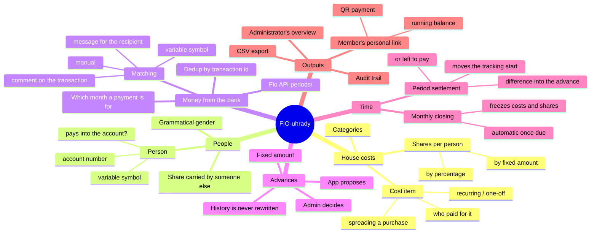
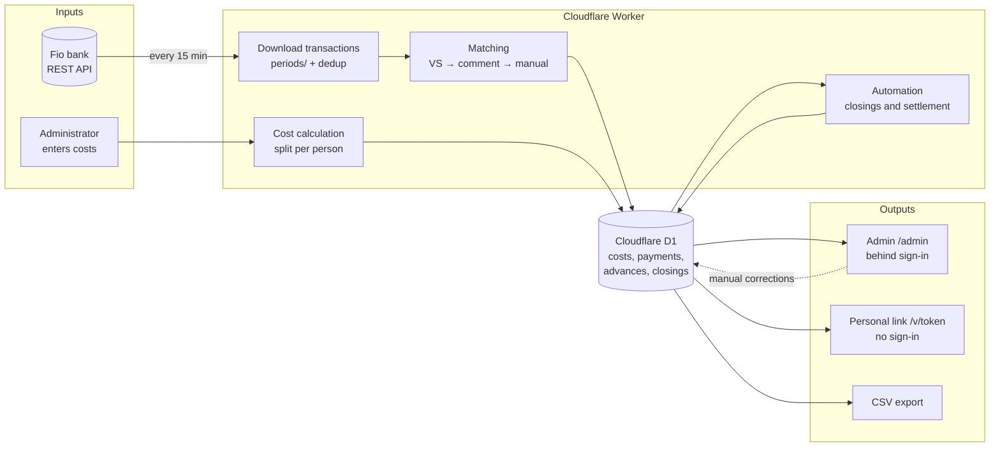
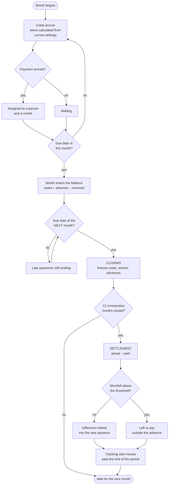
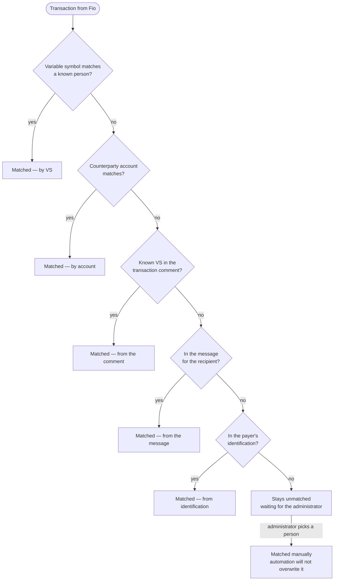
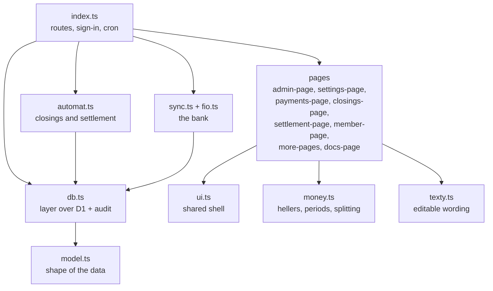

# Mind map and flow charts — FIO-uhrady

> How the pieces relate and in what order things happen.
> Czech original: [MAPA.md](MAPA.md) · rendered in a browser:
> [presentation.en.html](presentation.en.html)

## 1. Mind map — what the system is made of

## 2. Information flow — where the data comes from and goes

## 3. Life cycle of a month

## 4. Working out whose payment it is

**Only numbers that match a registered variable symbol are taken from free-text
fields** — otherwise matching would latch onto random numbers in notes (a date,
an amount, the counterparty's invoice number).

## 5. Code layers

