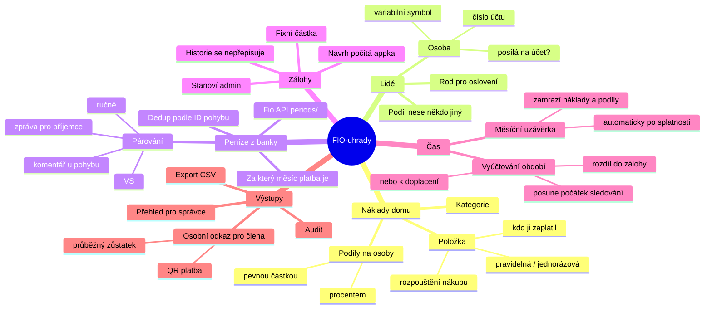
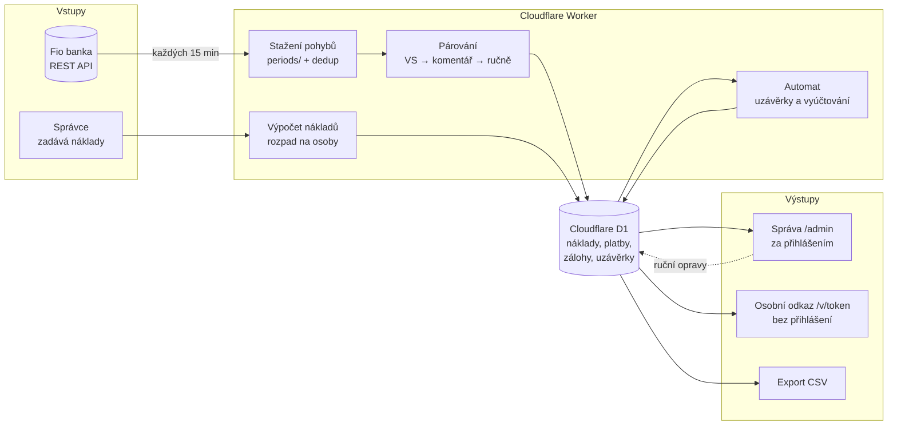
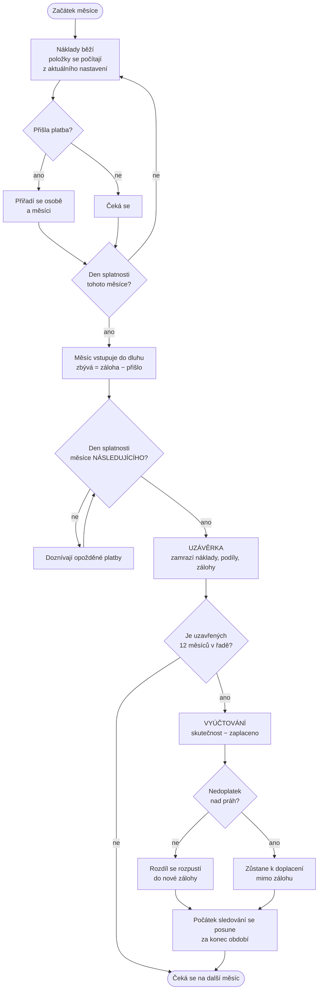
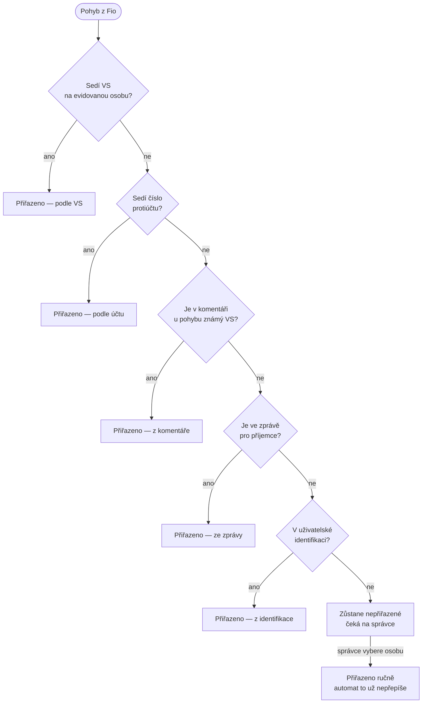
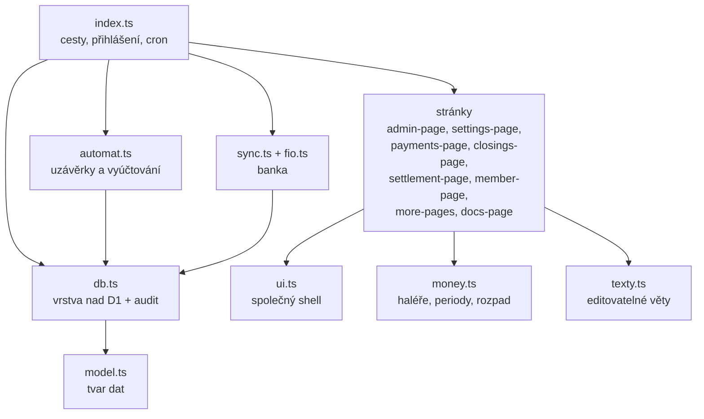

# Myšlenková mapa a vývojové diagramy — FIO-uhrady

> Jak spolu věci souvisí a v jakém pořadí se dějí.
> Anglicky: [MAP.en.md](MAP.en.md) · vykreslené v prohlížeči: [prezentace.html](prezentace.html)

## 1. Myšlenková mapa — z čeho se systém skládá

## 2. Tok informací — odkud kam tečou data

## 3. Životní cyklus měsíce — co se kdy stane

## 4. Jak se pozná, komu platba patří

**Z textových polí se berou jen čísla, která odpovídají některému evidovanému
VS** — jinak by se do párování chytala náhodná čísla z poznámek (datum, částka,
číslo faktury protistrany).

## 5. Vrstvy kódu

